<picture>
  <source media="(prefers-color-scheme: dark)" srcset="banner.svg">
  <source media="(prefers-color-scheme: light)" srcset="banner.svg">
  
</picture>

---

Most organizations run AI agents that call external APIs, handle customer data,
and make autonomous decisions — without knowing where the data goes,
who authorized the call, or where the response is stored.

I fix that.

**What I work on:**

- **Agentic AI Security** — prompt injection defense, tool contracts,
  circuit breaker patterns for autonomous AI systems
- **Sovereign AI Infrastructure** — local inference on Apple Silicon (MLX, vLLM),
  EU-compliant model governance, cloud exit strategies
- **Enterprise AI Architecture** — RAG pipelines, AI gateways, and compliance
  evidence chains under EU AI Act, GDPR & NIS2

  **Writing:**
- [Medium](https://medium.com/@michael.hannecke) — Patterns for sovereign AI that survive Monday morning
- [LinkedIn](https://www.linkedin.com/in/michaelhannecke/?locale=en-US) — Posts on AI security & enterprise architecture

**Open Source:**
- 🛡️ [Prompt Injection Guard](https://github.com/michaelhannecke/claude-injection-guard) — Two-stage detection for Claude Code agents
  with local LLM classification
- 🍎 [apple-silicon](https://github.com/michaelhannecke/apple-silicon) — Sovereign AI inference on Apple Silicon — MLX, containerization, and local model deployment
- ⚡ [sovereign-vllm-metal](https://github.com/michaelhannecke/sovereign-vllm-metal) — vLLM on Apple Silicon Metal — step-by-step sovereign inference setup
- 🐳 [claude_in_devcontainer](https://github.com/michaelhannecke/claude_in_devcontainer) — Run Claude Code in isolated dev containers for secure agentic workflows
- 📊 [pbi-mcp-wiki-generator](https://github.com/michaelhannecke/pbi-mcp-wiki-generator) — Auto-generate documentation wikis from Power BI datasets via Power BI MCP server
- 🔑 [appcredmon](https://github.com/michaelhannecke/appcredmon) — Monitor and alert on expiring app credentials in Azure/Entra ID

📍 Germany · Founder of [bluetuple.ai](https://bluetuple.ai)
